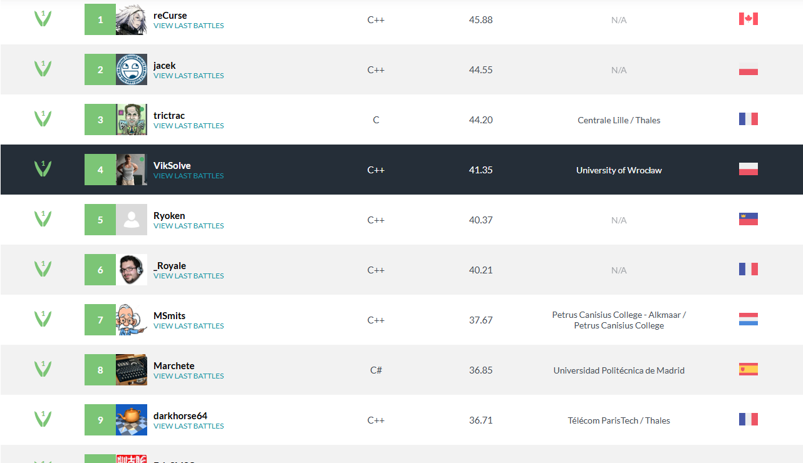

### [IN DEVELOPMENT!] English Draughts Engine & Bot
[Leaderboard](https://www.codingame.com/multiplayer/bot-programming/checkers/leaderboard)

This project is my implementation of an engine and bot for English draughts. It currently ranks 4th worldwide and 2nd in Poland on CodinGame. Since CodinGame compiles C++ code with the -O0 flag, every aspect of the implementation is highly optimized, sometimes at the expense of code readability. Please forgive any less-than-ideal code structure.

The core search is based on minimax with iterative deepening, enhanced by alpha-beta pruning, a transposition table, an evaluation function, and several additional heuristics. It’s a bitboard implementation and incorporates killer-move heuristics, cache optimizations, and hash-move ordering to boost move ordering and overall search efficiency.

Currently ranked 4th worldwide (and 2nd in Poland), the main objective of this project is to claim first place—which would mean my bot has outperformed every neural-network-based opponent. Notably, it achieves this level of play without using any neural networks, relying purely on optimized bitboard search and heuristics.

TODO:
In the month following this commit, I will refactor the code to improve readability, restructure key routines to be as branch-free as possible, introduce and tune additional heuristics to further guide the search, experiment extensively and select the strongest evaluation function, apply a suite of low-level optimizations for maximal speed, and finally build a standalone application so that anyone can challenge the bot directly.

